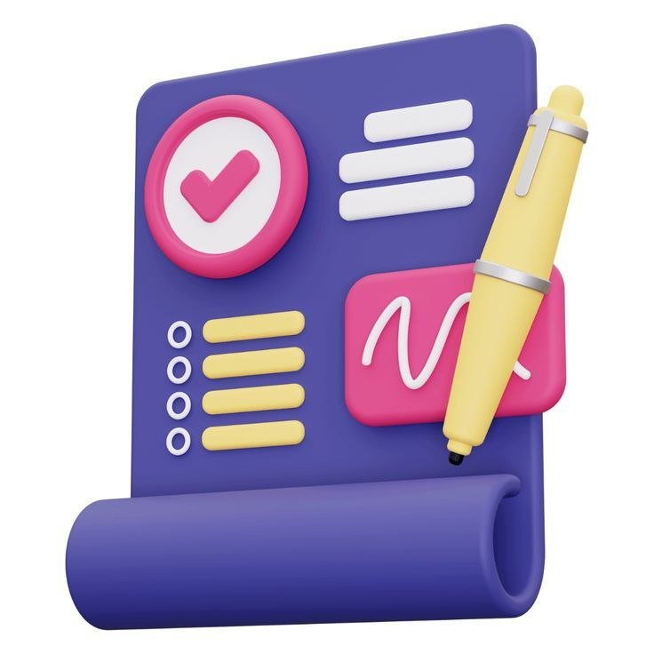
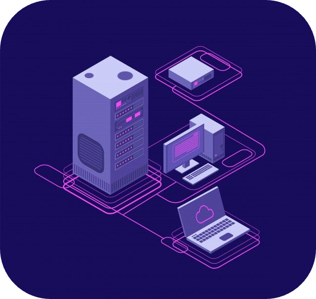
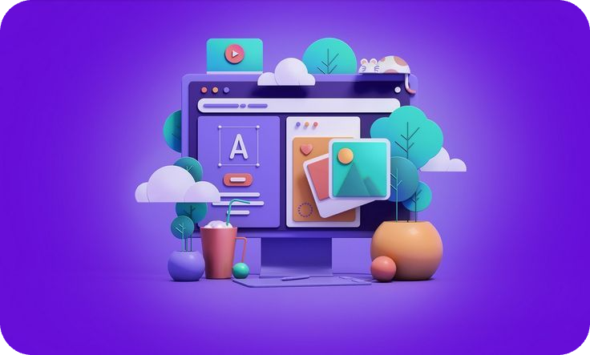
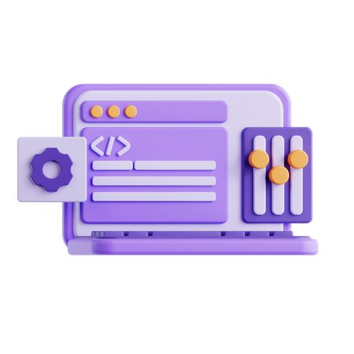
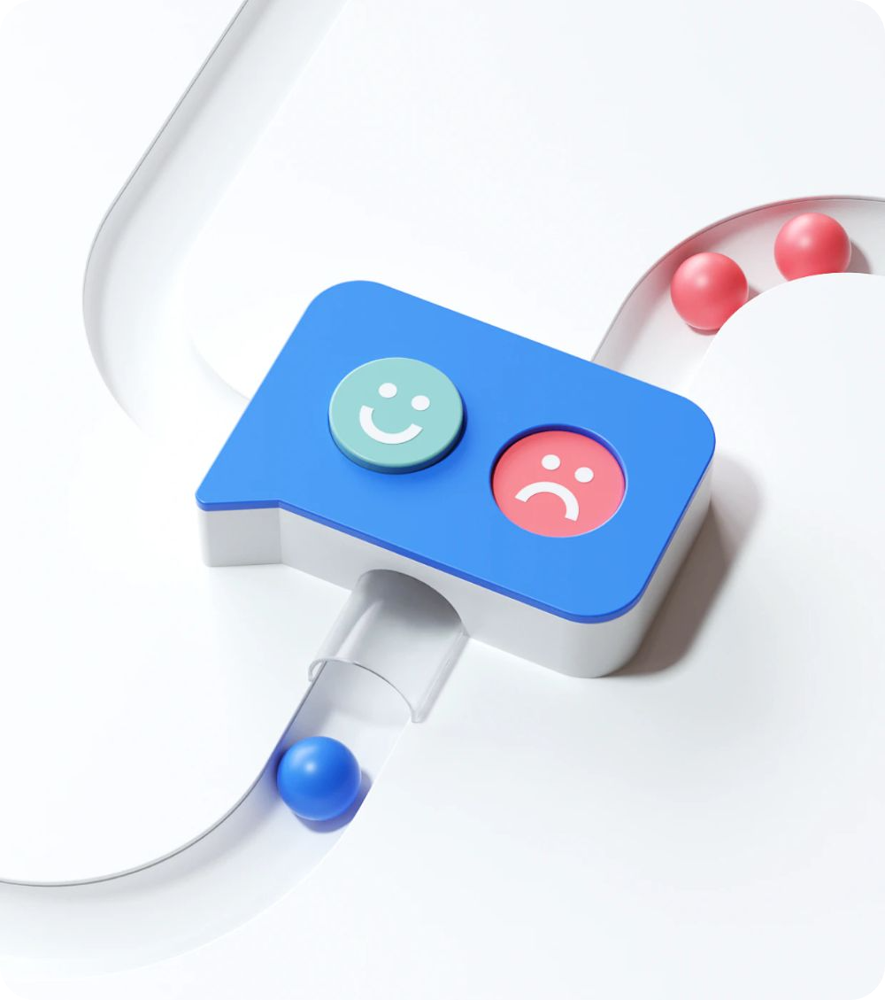
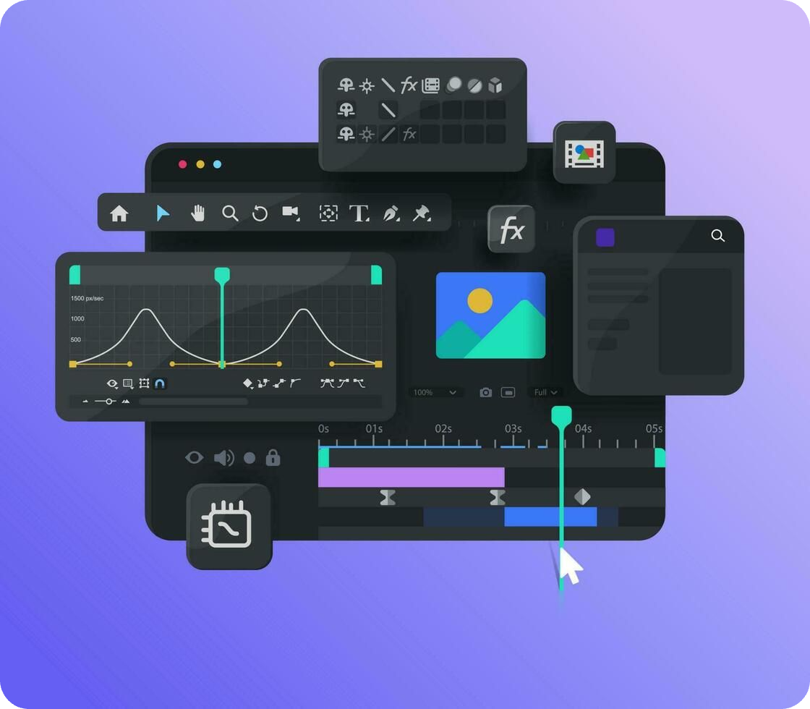

<!-- Opening -->

  <h1>
    
  </h1>
  <h3>I architect and build scalable decentralized applications across Rust and EVM ecosystems. From smart contracts to mobile apps, I deliver complete Web3 solutions with security-first mindset.</h3>

<!-- Animated wave -->

<!-- Badges -->

  
  
  
  
  
  
  
  
  
  
  
  
  

 

<h2 align="center">WHAT I OFFER</h2>

<table align="center" width="100%">
  <!-- Row 1: Image Left, Text Right -->
  <tr>
    <td align="right" width="20%">
      
    </td>
    <td align="left" width="30%">
      <h3>Smart Contracts Development</h3>
      
Highly secured and extremely gas-efficient Smart Contracts Development using Rust and Solidity.

    </td>
  </tr>

  <!-- Row 2: Text Left, Image Right -->
  <tr>
    <td align="right" width="30%">
      <h3>Smart Contracts Auditing</h3>
      
Professional security reviews with vulnerability detection and detailed remediation reports.

    </td>
    <td align="left" width="20%">
      
    </td>
  </tr>

  <!-- Row 3: Image Left, Text Right -->
  <tr>
    <td align="right" width="20%">
      
    </td>
    <td align="left" width="30%">
      <h3>Post-deployment On-chain Monitoring</h3>
      
Real-time on-chain monitoring with custom alerts, anomaly detection, and automated responses.

    </td>
  </tr>

  <!-- Row 4: Text Left, Image Right -->
  <tr>
    <td align="right" width="30%">
      <h3>Web Backend Server</h3>
      
High-performance Rust and Node.js APIs with REST/GraphQL endpoints and database optimization.

    </td>
    <td align="left" width="20%">
      
    </td>
  </tr>

  <!-- Row 5: Image Left, Text Right -->
  <tr>
    <td align="right" width="20%">
      
    </td>
    <td align="left" width="30%">
      <h3>Web Frontend</h3>
      
Modern React applications with responsive design, and intuitive Web3 user experiences.

    </td>
  </tr>

  <!-- Row 6: Text Left, Image Right -->
  <tr>
    <td align="right" width="30%">
      <h3>Mobile App Development</h3>
      
Native iOS (Swift), Android (Kotlin), and cross-platform React Native apps with seamless Web3 integration.

    </td>
    <td align="left" width="20%">
      
    </td>
  </tr>
</table>

<h2 align="center">DEVELOPMENT APPROACH</h2>

<table align="center" width="100%">
  <!-- Row 1: Image Left, Text Right -->
  <tr>
    <td align="right" width="20%">
      
    </td>
    <td align="left" width="30%">
      <h3>Documentation</h3>
      
Clear specifications and comprehensive project documentation for seamless development workflow.

    </td>
  </tr>

  <!-- Row 2: Text Left, Image Right -->
  <tr>
    <td align="right" width="30%">
      <h3>Test Driven Development</h3>
      
100% test coverage with unit, integration, and end-to-end testing for robust applications.

    </td>
    <td align="left" width="20%">
      
    </td>
  </tr>

  <!-- Row 3: Image Left, Text Right -->
  <tr>
    <td align="right" width="20%">
      
    </td>
    <td align="left" width="30%">
      <h3>Staging</h3>
      
Pre-production environment testing to ensure seamless deployment and performance validation.

    </td>
  </tr>

  <!-- Row 4: Text Left, Image Right -->
  <tr>
    <td align="right" width="30%">
      <h3>User Acceptance Testing</h3>
      
Comprehensive UATs with stakeholder feedback integration and requirement validation.

    </td>
    <td align="left" width="20%">
      
    </td>
  </tr>

  <!-- Row 5: Image Left, Text Right -->
  <tr>
    <td align="right" width="20%">
      
    </td>
    <td align="left" width="30%">
      <h3>Production</h3>
      
Live deployment with monitoring, scaling, and maintenance for optimal performance.

    </td>
  </tr>
</table>

---

<h2 align="center">⭐ Premium Features</h2>

<table align="center">
  <tr>
    <td align="center" width="33%">
       
      <strong>📱 Mobile-First</strong> 
      Native performance
    </td>
    <td align="center" width="33%">
       
      <strong>🔒 Security by Design</strong> 
      Audit experience
    </td>
    <td align="center" width="33%">
      ⛽️ 
      <strong>💰 Gas Optimized</strong> 
      Cost efficient
    </td>
  </tr>
</table>

<h2 align="center">🏆 Competitive Edge</h2>

<table align="center">
  <tr>
    <td align="center" width="25%">
       
      <strong>🔒 Security Expertise</strong> 
      Certified Smart Contract Auditor with real findings
    </td>
    <td align="center" width="25%">
       
      <strong>🛡️ OpenZeppelin Contributor</strong> 
      Industry-standard security practices
    </td>
    <td align="center" width="25%">
       
      <strong>🏅 Competition Experience</strong> 
      Active in Sherlock, Cantina, Code4rena
    </td>
    <td align="center" width="25%">
       
      <strong>🎆 Proven Track Record</strong> 
      4+ years successful freelancing
    </td>
  </tr>
</table>

---

<h2 align="center">🤝 **Let's Build the Future**</h2>

  <h3>Ready to bring your Web3 vision to life?</h3>
  
<em>From concept to deployment, I deliver complete DApp solutions that users love and protocols trust.</em>

  <table>
    <tr>
      <td align="center">
        <a href="mailto:m-waqas171288@gmail.com">
          
           <strong>Gmail</strong>
        </a>
      </td>
      <td align="center">
        <a href="https://www.linkedin.com/in/waqas-muhammad-5699419a/">
          
           <strong>LinkedIn</strong>
        </a>
      </td>
      <td align="center">
        <a href="https://x.com/Waqas171288">
          
           <strong>Twitter</strong>
        </a>
      </td>
      <td align="center">
        <a href="https://upwork.com/">
          
           <strong>Upwork</strong>
        </a>
      </td>
      <td align="center">
        <a href="https://www.fiverr.com/">
          
           <strong>Fiverr</strong>
        </a>
      </td>
    </tr>
  </table>

<i style="color: #64748b;">"Building tomorrow's decentralized global future."</i>

<!-- Footer Wave -->

  

<!-- Animated Footer Message -->

  

